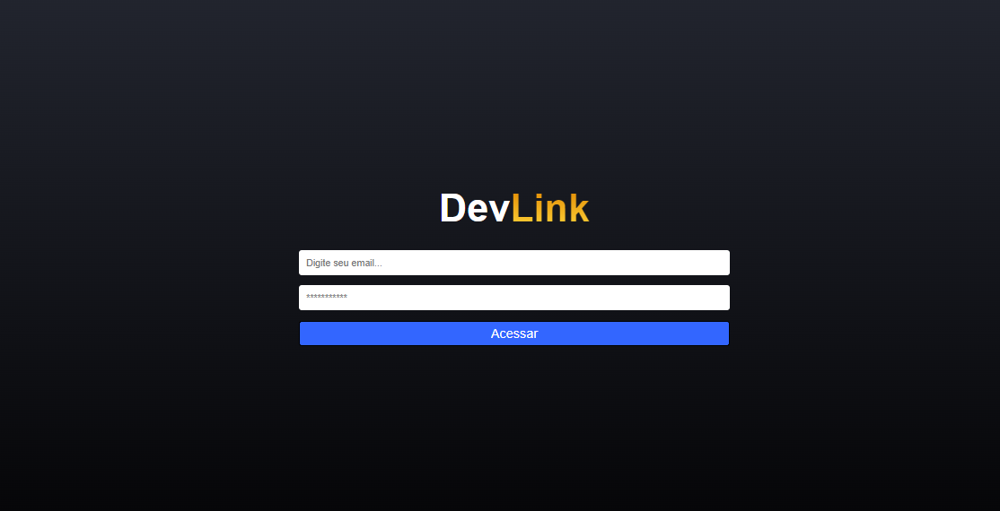
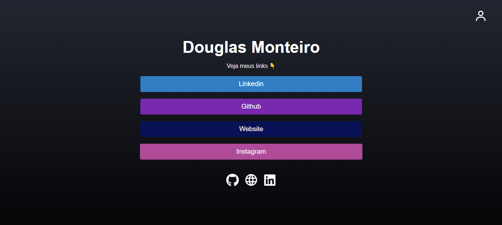
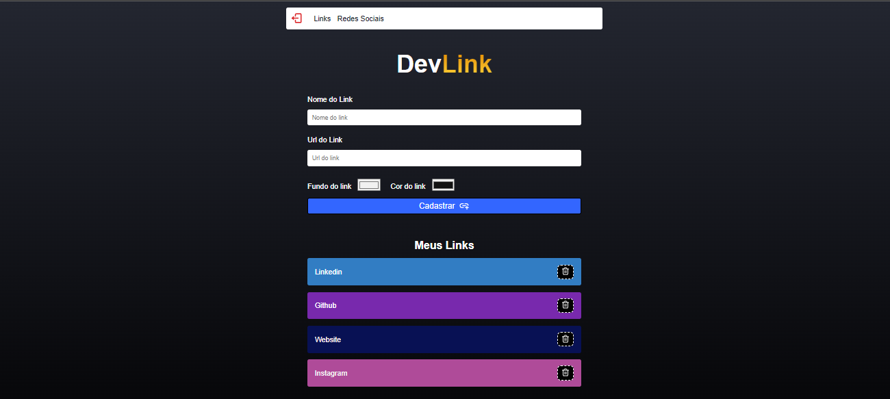

# DEV LINKS

      

      

  

## Objetivo:

### Foi criar um sistema web onde o usuário permita casdastrar links de suas redes sociais.

## Descrição

###

### <i> Infos: </i>

- `Projeto criado com ReactJs e firebase para autenticação.`
- `Usuário para login email:douglas@teste.com password:123456`
- `Somente há a possibilidade de cadastrar links se o usuário estiver logado`
- `Rotas privadas onde somente o usuário logado pode acessar`
- `Manipulação de banco de dados do firebase`
- `Links intuitivos para redirecionamento na página home `

## <i>Douglas Monteiro</i> 😁🔥🚀
